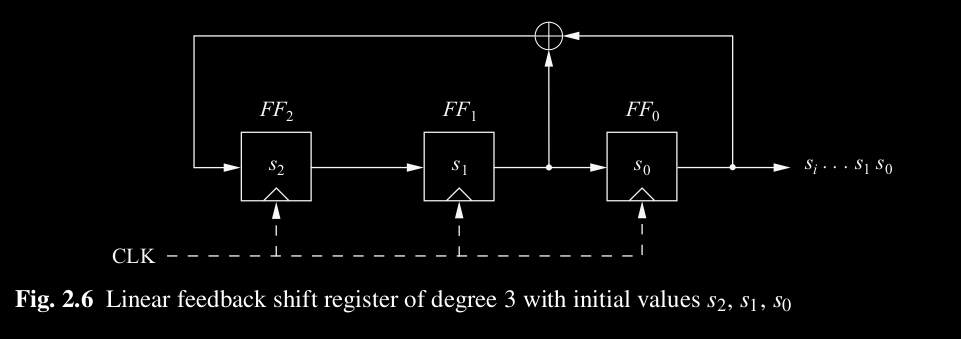

# Linear Feedback Shift Register (LFSR)

A Linear Feedback Shift Register (LFSR) is a hardware or software implementation of a pseudo-random number generator based on a sequence of binary bits (0s and 1s). It utilizes a simple shifting and XOR operation to produce a seemingly random sequence of bits.

A linear feedback shift register is a special type of recurrence relation where
- The preceding terms are not raised to the power
- There are no added constant.

A recurrence sequence for every terms is depend on each other.

An LFSR consists of clocked storage elements (flip-flops) and a feedback path. The number of storage elements gives us the degree of the LFSR. In other words, an LFSR with m flip-flops is said to be of degree m. The feedback network computes the input for the last flip-flop as XOR-sum of certain flip-flops in the shift register.

## Simple LFRS
Simple LFSR We consider an LFSR of degree m = 3 with flip-flops FF2 , FF1 , FF0 , and a feedback path.

The internal state bits are
denoted by si and are shifted by one to the right with each clock tick. The rightmost state bit is also the current output bit. The leftmost state bit is computed in the feedback path, which is the XOR sum of some of the flip-flop values in the previous clock period. Since the XOR is a linear operation, such circuits are called **linear feedback shift registers**.

Let assume an initial state of (s2 = 1, s1 = 0, s0 = 0)

Table form

|clk|FF2|FF1|$FF0 = s_i$|
|---|---|---|---|
|0| 1| 0| 0|
|1| 0| 1| 0|
|2| 1| 0| 1|
|3| 1| 1| 0|
|4| 1| 1| 1|
|5| 0| 1| 1|
|6| 0| 0| 1|
|7| 1| 0| 0|
|8 |0 |1 |0|

starts to repeat after ***clock cycle 6***. This means the LFSR output has **period of length 7** and has the form:

$0010111 0010111 0010111 . . .$

Formula for above LFSR is 

$$
s_{i+3} \cong s_{i+1} + s_i \pmod{2}
$$