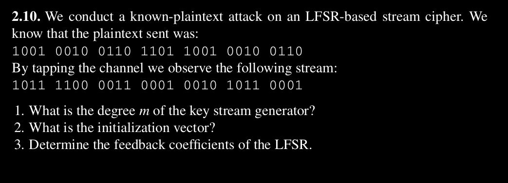

# Problem 2.10

Regrading with above information, there are following questions that we have to answer.

1. What is **the degree m** of the key stream generator?
2. What is the initialization vector?
3. Determine the feedback coefficients of the LFSR.

#
***According to problem***, we have following known information.

Plaintext: `1001 0010 0110 1101 1001 0010 0110`

Incomming Cipher Stream: `1011 1100 0011 0001 0010 1011 0001`

Frist step: we will compute the key stream by:

"***Ciphertext $y_i$***" $\oplus$ "***Plaintext $x_i$***"

$x_i: 1001 0010 0110 1101 1001 0010 0110$ $\oplus$

$y_i: 1011 1100 0011 0001 0010 1011 0001$ 

---
$s_i: 0010 1110 0101 1100 1011 1001 0111$

Each ***7 bits of block***, we will see the repeated sequence:

"$0010111$ $0010111$ $0010111$ $0010111$"

***1) Degree of 'm'***

Sequence repeated after block of 7 bits, according to thoerem $2^m -1$, **degree(m) is 3**.

***2. What is the initialization vector?***

Key stream: "$0010111$ $0010111$ $0010111$ $0010111$"

Initialization vector: $001$.

***3. Determine the feedback coefficients of the LFSR.***

Following equation are general linear recurrences relationship,

$$
s_{i+m} \cong \sum_{j=0}^{m-1} p_j.s_{i+j} \pmod{2}; s_i, p_j \in {0,1}, i=0,1,2,3
$$

So, we knowns the Initialization vector, Degree of LFRSs but we don't known the coefficient $p_{m-1}$.

Given: $s_i = 0010 1110 0101 1100 1011 1001 0111$

$s_0 = 0, s_1 = 0, s_2=1, s_3 = 0, s_4 = 1, s_5 = 1$

$s_3 \cong p_0.s_0 + p_1.s_1 + p_2.s_2 \cong p_0.0 + p_1.0 + p_2.1 \cong 0$

$s_4 \cong p_0.s_1 + p_1.s_2 + p_2.s_3 \cong p_0.0 + p_1.1 + p_2.0 \cong 1$

$s_5 \cong p_0.s_2 + p_1.s_3 + p_2.s_4 \cong p_0.1 + p_1.0 + p_2.1 \cong 1$

We can use "Gaussian Elimation" or "Matrix Inverse". In this problem, I will use "Matrix Inverse" technique.

then we end up with following matrix:

***Matrix inverse method***:

$$
x = A^{-1}.B
$$

$$
A^{-1} =
\left[
\begin{matrix}
0 & 0 & 1 \\
0 & 1 & 0 \\
1 & 0 & 1 \\
\end{matrix}
\right] ^ {-1}
=
\left[
\begin{matrix}
-1 & 0 & 1 \\
0 & 1 & 0 \\
1 & 0 & 0 \\
\end{matrix}
\right]
$$

$$
x
=
\left[
\begin{matrix}
p_0 \\
p_1 \\
p_2 \\
\end{matrix}
\right],
B
=
\left[
\begin{matrix}
0 \\
1 \\
1 \\
\end{matrix}
\right]
$$

Let's calculate,

$$
\left[
\begin{matrix}
p_0 \\
p_1 \\
p_2 \\
\end{matrix}
\right] =
\left[
\begin{matrix}
-1 & 0 & 1 \\
0 & 1 & 0 \\
1 & 0 & 0 \\
\end{matrix}
\right]
\left[
\begin{matrix}
0 \\
1 \\
1 \\
\end{matrix}
\right] =
\left[
\begin{matrix}
1 \\
1 \\
0 \\
\end{matrix}
\right] 
$$

So, feedback coefficients of the LFSR is $p_0 = 1, p_1 = 1, p_2 = 0$