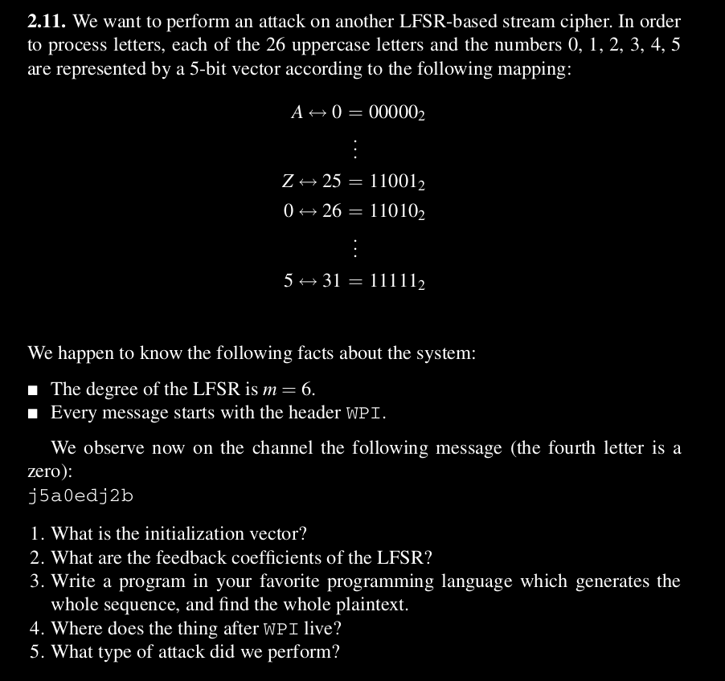
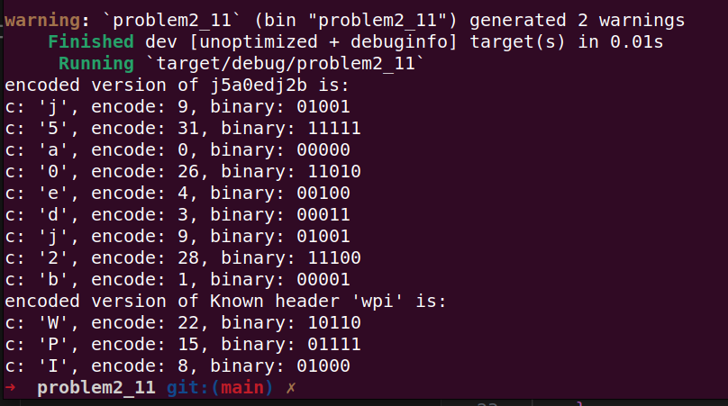
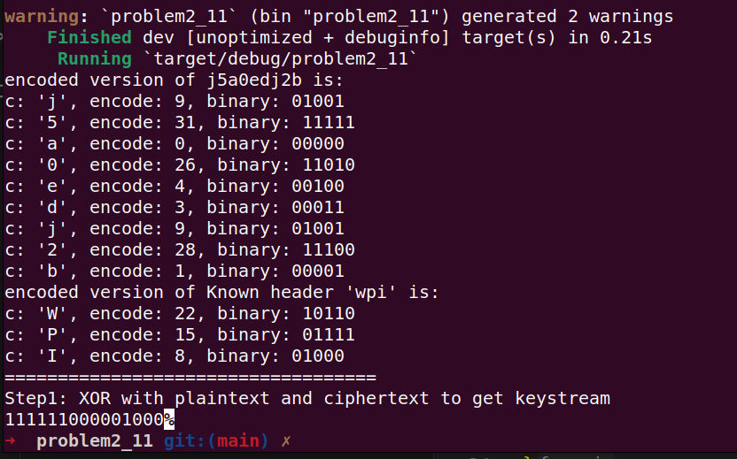
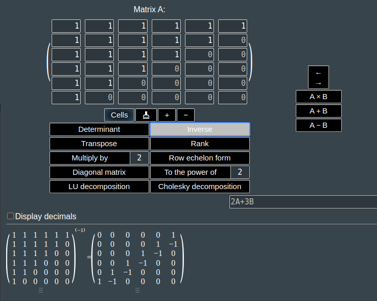
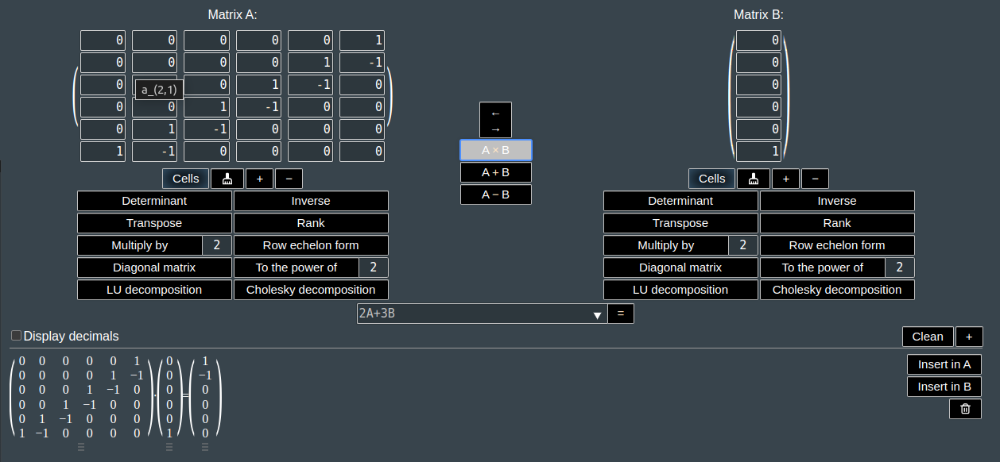
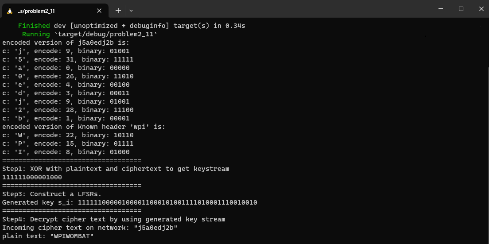

# Problem 2.11 (Known-plaintext Attack on LFSRs)

Regrading with above information, there are 5 questions that we have to answer.

1. What is the initialization vector?
2. What are the feedback coefficients of the LFSR?
3. Write a program in your favorite programming language which generates the whole sequence, and find the whole plaintext.
4. Where does the thing after WPI live?
5. What type of attack did we perform?

By given, we known the following information:

- $m = 6$
- Header message is "WPI"
- Ciphertext "j5a0edj2b"

### Step1: XOR operation on Ciphertext and Plaintext

In order to get key stream, we have to compare Header msg and first 3 bytes of cipher text.

ciphertext ($y_i$): 'j5a' => $01001 11111 00000$

plaintext ($x_i$): 'wpi' =>  $10110 01111 01000$

keystream ($s_i$): $11111 10000 01000$

***1. What is the initialization vector?***

According to key stream, the initialization vector is $s_i = 11111 10000 01000$

***2. What are the feedback coefficients of the LFSR?***

Following equation are general linear recurrences relationship,

$$
s_{i+m} \cong \sum_{j=0}^{m-1} p_j.s_{i+j} \pmod{2}; s_i, p_j \in {0,1}, i=0,1,2,3
$$

So, we knowns the Initialization vector, Degree of LFRSs but we don't known the coefficient $p_{m-1}$.

Given: $s_i = 11111 10000 01000, m=6$

$s_0 = s_1 = s_2 = s_3 = s_4 = s_5 = s_{11} = 1$

$s_6 = s_7 = s_8 = s_9 = s_{10} = s_{12} = 0$

For $s_6$,

$s_6 \cong p_0.s_0 + p_1.s_1 + p_2.s_2 + p_3.s_3 + p_4.s_4 + p_5.s_5 \cong 0$

$s_6 \cong p_0.1 + p_1.1 + p_2.1 + p_3.1 + p_4.1 + p_5.1 \cong 0$

For $s_7$,

$s_7 \cong p_0.s_1 + p_1.s_2 + p_2.s_3 + p_3.s_4 + p_4.s_5 + p_5.s_6 \cong 0$

$s_7 \cong p_0.1 + p_1.1 + p_2.1 + p_3.1 + p_4.1 + p_5.0 \cong 0$

For $s_8$,

$s_8 \cong p_0.s_2 + p_1.s_3 + p_2.s_4 + p_3.s_5 + p_4.s_6 + p_5.s_7 \cong 0$

$s_8 \cong p_0.1 + p_1.1 + p_2.1 + p_3.1 + p_4.0 + p_5.0 \cong 0$

For $s_9$,

$s_9 \cong p_0.s_3 + p_1.s_4 + p_2.s_5 + p_3.s_6 + p_4.s_7 + p_5.s_8 \cong 0$

$s_9 \cong p_0.1 + p_1.1 + p_2.1 + p_3.0 + p_4.0 + p_5.0 \cong 0$

For $s_{10}$,

$s_{10} \cong p_0.s_4 + p_1.s_5 + p_2.s_6 + p_3.s_7 + p_4.s_8 + p_5.s_9 \cong 0$

$s_{10} \cong p_0.1 + p_1.1 + p_2.0 + p_3.0 + p_4.0 + p_5.0 \cong 0$

For $s_{11}$,

$s_{11} \cong p_0.s_5 + p_1.s_6 + p_2.s_7 + p_3.s_8 + p_4.s_9 + p_5.s_{10} \cong 1$

$s_{11} \cong p_0.1 + p_1.0 + p_2.0 + p_3.0 + p_4.0 + p_5.0 \cong 1$

As summrize, we got following polynomial for $s_6$ to $s_{11}$,

$s_6 \cong p_0.1 + p_1.1 + p_2.1 + p_3.1 + p_4.1 + p_5.1 \cong 0$

$s_7 \cong p_0.1 + p_1.1 + p_2.1 + p_3.1 + p_4.1 + p_5.0 \cong 0$

$s_8 \cong p_0.1 + p_1.1 + p_2.1 + p_3.1 + p_4.0 + p_5.0 \cong 0$

$s_9 \cong p_0.1 + p_1.1 + p_2.1 + p_3.0 + p_4.0 + p_5.0 \cong 0$

$s_{10} \cong p_0.1 + p_1.1 + p_2.0 + p_3.0 + p_4.0 + p_5.0 \cong 0$

$s_{11} \cong p_0.1 + p_1.0 + p_2.0 + p_3.0 + p_4.0 + p_5.0 \cong 1$

We can use "Gaussian Elimation" or "Matrix Inverse" to find out the unknown coefficient. In this problem, I will use "Matrix Inverse" technique.

then we end up with following 6 x 6  matrix:

***Matrix inverse method***:

$$
x = A^{-1}.B
$$

$$
A =
\left[
\begin{matrix}
1 & 1 & 1 & 1 & 1 & 1 \\
1 & 1 & 1 & 1 & 1 & 0 \\
1 & 1 & 1 & 1 & 0 & 0 \\
1 & 1 & 1 & 0 & 0 & 0 \\
1 & 1 & 0 & 0 & 0 & 0 \\
1 & 0 & 0 & 0 & 0 & 0 \\
\end{matrix}
\right],
B = 
\left[
\begin{matrix}
0 \\
0 \\
0 \\
0 \\
0 \\
1 \\
\end{matrix}
\right],
x = 
\left[
\begin{matrix}
p_0 \\
p_1 \\
p_2 \\
p_3 \\
p_4 \\
p_5 \\
\end{matrix}
\right]
$$

Since matrix is 6 x 6, I used following online calculator to find the inverse of $A^{-1}$: https://matrixcalc.org/

I got the following matrix for inverse of A.

$$
A^{-1} =
\left[
\begin{matrix}
0 & 0 & 0 & 0 & 0 & 1 \\
0 & 0 & 0 & 0 & 1 & -1 \\
0 & 0 & 0 & 1 & -1 & 0 \\
0 & 0 & 1 & -1 & 0 & 0 \\
0 & 1 & -1 & 0 & 0 & 0 \\
1 & -1 & 0 & 0 & 0 & 0 \\
\end{matrix}
\right]
$$

Substitute the equation,

$$
\left[
\begin{matrix}
p_0 \\
p_1 \\
p_2 \\
p_3 \\
p_4 \\
p_5 \\
\end{matrix}
\right] =
\left[
\begin{matrix}
0 & 0 & 0 & 0 & 0 & 1 \\
0 & 0 & 0 & 0 & 1 & -1 \\
0 & 0 & 0 & 1 & -1 & 0 \\
0 & 0 & 1 & -1 & 0 & 0 \\
0 & 1 & -1 & 0 & 0 & 0 \\
1 & -1 & 0 & 0 & 0 & 0 \\
\end{matrix}
\right] .
\left[
\begin{matrix}
0 \\
0 \\
0 \\
0 \\
0 \\
1 \\
\end{matrix}
\right] =
\left[
\begin{matrix}
1 \\
-1 \\
0 \\
0 \\
0 \\
0 \\
\end{matrix}
\right]
$$

We are opearting under mod 2. So, for $-1 \cong 1 \pmod{2}$. Then we got this,

$$
\left[
\begin{matrix}
p_0 \\
p_1 \\
p_2 \\
p_3 \\
p_4 \\
p_5 \\
\end{matrix}
\right] =
\left[
\begin{matrix}
1 \\
1 \\
0 \\
0 \\
0 \\
0 \\
\end{matrix}
\right]
$$

**Answer:** $p_0 = p_1 = 1$, $p_2 = p_3 = p_4 = p_5 = 0$ respectivelly.

***4. Where does the thing after WPI live?***

According to the Plain text: **"WOMBAT"**

***5. What type of attack did we perform?***

We did ***("Known-plaintext Attack")***.